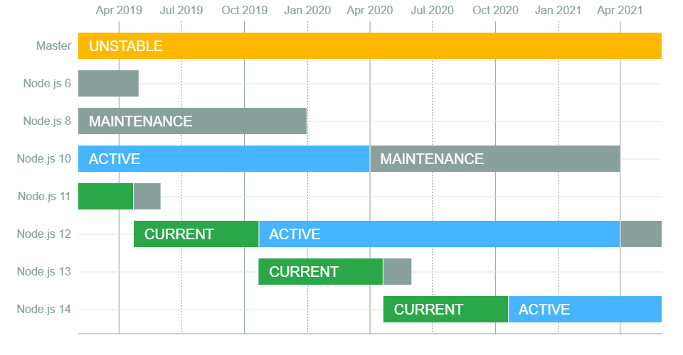
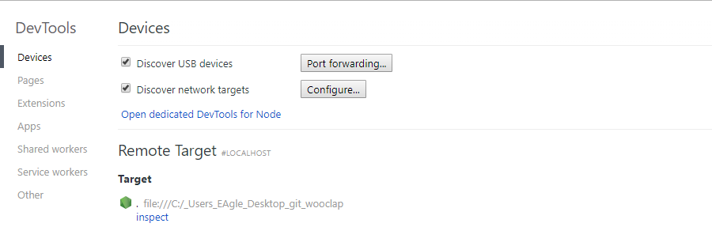

# Week 1

# Table of contents

* [Week 1](#week-1)
* [Table of contents](#table-of-contents)
* [Video](#video)
* [Introduction](#introduction)
   * [What is Node.js](#what-is-nodejs)
   * [How to install node.js: via Node Version Manager (nvm)](#how-to-install-nodejs-via-node-version-manager-nvm)
   * [On Linux/macOS](#on-linuxmacos)
   * [On Windows](#on-windows)
   * [Node.js release cycle](#nodejs-release-cycle)
* [The basics](#the-basics)
   * [First program using node.js](#first-program-using-nodejs)
   * [Debugging a node.js program](#debugging-a-nodejs-program)
      * [Errors in node.js](#errors-in-nodejs)
      * [Chrome Dev tools](#chrome-dev-tools)
   * [require() statement](#require-statement)
   * [Sharing functions using module.exports](#sharing-functions-using-moduleexports)
   * [Exporting multiple functions using module.exports](#exporting-multiple-functions-using-moduleexports)
   * [A note about variable scoping](#a-note-about-variable-scoping)
   * [Exercise: making a command line calculator](#exercise-making-a-command-line-calculator)
      * [Problem](#problem)
      * [Solution](#solution)
      * [Bonus](#bonus)
* [Native modules](#native-modules)
   * [File System](#file-system)
      * [fs.readFile definition](#fsreadfile-definition)
      * [Callbacks in node.js](#callbacks-in-nodejs)
      * [Displaying the content of a file using fs.readfile](#displaying-the-content-of-a-file-using-fsreadfile)
      * [Writing to a file using fs.writeFile](#writing-to-a-file-using-fswritefile)
   * [Path](#path)
   * [Process](#process)
      * [Retrieving a specific argument value](#retrieving-a-specific-argument-value)
      * [Argument values are always strings](#argument-values-are-always-strings)
      * [Passing a string with spaces](#passing-a-string-with-spaces)
* [Homework for next week](#homework-for-next-week)
   * [Exercice](#exercice)
      * [Some pointers](#some-pointers)

# Video

The video of the lecture can be found here: [https://drive.google.com/open?id=1FtwC3FYT6ZMODRo4Acppz8MvuKQ9JpVF](https://drive.google.com/open?id=1FtwC3FYT6ZMODRo4Acppz8MvuKQ9JpVF).

# Introduction

## What is Node.js

References:

- [https://nodejs.org/en/](https://nodejs.org/en/)
- [https://www.youtube.com/watch?v=w-7RQ46RgxU&list=PL4cUxeGkcC9gcy9lrvMJ75z9maRw4byYp](https://www.youtube.com/watch?v=w-7RQ46RgxU&list=PL4cUxeGkcC9gcy9lrvMJ75z9maRw4byYp)
- [https://www.freecodecamp.org/news/what-exactly-is-node-js-ae36e97449f5/](https://www.freecodecamp.org/news/what-exactly-is-node-js-ae36e97449f5/)

Node.js is a JavaScript runtime environment. This means that it offers an environment to run and execute JavaScript code. It is built on the [Chrome's V8 JavaScript engine](https://v8.dev/) which is the engine that executes code in the Google Chrome browser.

In short any code that is valid JavaScript will be valid in Node.js. However, Node.js also adds some useful features such as `require` and `module.exports` function to share code between files, and native modules (e.g. `fs`, `path`) that we will look at in the next sections.

Node.js can be used for different tasks such as making scripts (we will use to access the file system this week) or to create a web server (using external libraries such as Express.js for instance). 

Some advantages of using Node.js are

- It is an open source server environment.
- It is free.
- It runs on various platforms (Windows, Linux, Unix, Mac OS X, etc.).
- It uses JavaScript on the server. This means we don't have to learn a completely new language to power our server (back-end).

## How to install node.js: via Node Version Manager (nvm)

It is possible to install node.js by downloading an installer from the [official Node.js website](https://nodejs.org/en/). However, we can also install it using a tool called *nvm* (Node Version Manager). This allows us to install node.js from the command line and we can also install multiple versions of node.js simultaneously, and switch to one of those versions easily. This is usually preferred because if you are working on different applications, they might require different versions of node.js to run, so it's useful to be able to switch easily between those versions.

There are two versions of nvm:

- [nvm-sh](https://github.com/nvm-sh/nvm): this version can be used for Linux and macOS.
- [nvm-windows](https://github.com/coreybutler/nvm-windows): this is a separate tool, but it's very similar. It runs on Windows.

## On Linux/macOS

Note: you should always check if the following instructions are up-to-date on the [Github repository for nvm-sh](https://github.com/nvm-sh/nvm).

Run the command in your terminal

`bash` 

    $ curl -o- https://raw.githubusercontent.com/nvm-sh/nvm/v0.34.0/install.sh | bash

It should install `nvm`. In order to use it, you might have to restart your terminal (i.e. close the window and open a new one). Once installed, you can use the following commands

- `nvm install 10.15.3`: installs node.js v10.15.3 on your computer. You can replace this version number by one of the valid versions found [here](https://nodejs.org/dist/).
- `nvm use 10.15.3`: switches to the installation of node.js v10.15.3. You can use this command to switch between installed versions of node.js.
- `nvm alias default 10.15.3`: sets the node.js v10.15.3 as the default version when you open the terminal.
- `nvm ls`: lists all the versions of node.js installed on your computer. The default version should have a `(default)` prefix.

## On Windows

Note: you should always check if the following instructions are up-to-date on the [Github repository for nvm-](https://github.com/nvm-sh/nvm)windows.

Go to the [Release page on Github](https://github.com/coreybutler/nvm-windows/releases) and dowload the latest version of *nvm-setup.zip*. Once downloaded, unzip the archive and run the installer.

It should install `nvm`. In order to use it, you might have to restart your terminal (i.e. close the window and open a new one). Once installed, you can use the following commands

- `nvm install 10.15.3`: installs node.js v10.15.3 on your computer. You can replace this version number by one of the valid versions found [here](https://nodejs.org/dist/).
- `nvm use 10.15.3`: switches to the installation of node.js v10.15.3. You can use this command to switch between installed versions of node.js. It will also set this version as the default one when you open a new terminal.
- `nvm ls`: lists all the versions of node.js installed on your computer. The default version should have a star * prefix.

## Node.js release cycle

It's helpful to know a little bit about the [node.js release cycle](https://github.com/nodejs/Release).

A new major version of node.js (major version means that the first number changes) is released each 6 months as follows:

- New even-numbered versions (e.g. v6, v8, v10, etc) are released in April.
- New odd-numbered versions (e.g. v5, v7, v9) are released in October.

When a new odd-numbered major release is out, the previous even-numbered major version transitions to the Long Term Support (LTS) plan. LTS means that this version will still be maintained for some time after it's released: it will get bug fixes, security updates, etc. but no new breaking features.

It's also important to note that only even-numbered versions become LTS. Odd-numbered are never supported for a long time: they should typically not be used in a production environment. In short, odd-numbered versions have the latest features, but they might be unstable; you will most likely use a stable (even-numbered) version of node.js all the time.

You can find out more information about the node.js release cycle [here](https://nodesource.com/blog/understanding-how-node-js-release-lines-work/).

# The basics

## First program using node.js

Relevant video: [https://www.youtube.com/watch?v=lK42xIMcA0Y&list=PL4cUxeGkcC9gcy9lrvMJ75z9maRw4byYp&index=5](https://www.youtube.com/watch?v=lK42xIMcA0Y&list=PL4cUxeGkcC9gcy9lrvMJ75z9maRw4byYp&index=5)

We're going to create a file called `hello-world.js` . When we want to run this file, we are going to use the `node <filename>` command like so: `node ./hello-world.js`.

`hello-world.js`

    console.log('Hello world');

`bash` 

    $ Hello world!

Everything that is valid in JavaScript is still valid in node.js.

`hello-world.js`

    console.log('Hello world');
    
    const a = 10;
    const b = 12;
    
    const sum = a + b;
    
    console.log('The sum is', sum);

`bash` 

    $ Hello world!
    $ The sum is 22

## Debugging a node.js program

### Errors in node.js

When there is an error in your code, your program might crash and you might see an error like this in your terminal

`bash` 

    $ Error: Cannot find module './does-not-exist.js'
    	  at Function.Module._resolveFilename (module.js:538:15)
    		at Function.Module._load (module.js:468:25)
    		at Module.require (module.js:587:17)
    		at require (internal/module.js:11:18)
    		at Object.<anonymous> (C:\path\to\file\hyf\main.js:2:1)
    		at Module._compile (module.js:643:30)
    		at Object.Module._extensions..js (module.js:654:10)
    		at Module.load (module.js:556:32)
    		at tryModuleLoad (module.js:499:12)
    		at Function.Module._load (module.js:491:3)

You should become familiar with this syntax for error because it might provide useful information to debug your code. The error has

- a message (`Cannot find module './does-not-exist.js'`) which details what happened (it couldn't find a file).
- a stack trace provides the call stack (the different function calls) which led to the error. The first line (`at Function.Module._resolveFilename (module.js:538:15)`) is the location of the code which created this error (in your code or in a library). The second line is the location which led to the call from the first line. And this process continues until the last line which is the location in the code which initiated this call stack.

          at Function.Module._resolveFilename (module.js:538:15)
        	at Function.Module._load (module.js:468:25)
        	at Module.require (module.js:587:17)
        	at require (internal/module.js:11:18)
        	at Object.<anonymous> (C:\path\to\file\hyf\main.js:2:1)
        	at Module._compile (module.js:643:30)
        	at Object.Module._extensions..js (module.js:654:10)
        	at Module.load (module.js:556:32)
        	at tryModuleLoad (module.js:499:12)
        	at Function.Module._load (module.js:491:3)

### Chrome Dev tools

Even though errors in the terminal can help you determine issues with your command, it can be useful to use an interactive debugger. When you install node.js, it ships with an interactive debugger based on the Chrome Dev Tools (this will be used when debugging JavaScript code in the frontend). To run your application in debug mode, you can use the following commands

- `node --inspect index.js`: starts the file `index.js` in debug mode.
- `node --inspect-brk index.js`: same as above, except that it will pause (`brk` stands for *break*) at the first line of the program. This is useful if you want to debug a program which executes right away: if you don't do this, the program might execute and finish before you have a time to debug it.

Once your script is started in debug mode, you can navigate to the following page in Google Chrome: chrome://inspect/#devices. You should have something like this

You can use the *inspect* link to open the Chrome Dev Tools for your application.

For examples on how to use the Chrome Dev Tools, you can watch those videos:

- [Debugging in 2017 with Node.js](https://www.youtube.com/watch?v=Xb_0awoShR8)
- [Debugging Node.js with Google Chrome and Visual Studio Code](https://www.youtube.com/watch?v=hfpkMyvSOp4)

## `require()` statement

Relevant video: [https://www.youtube.com/watch?v=xHLd36QoS4k](https://www.youtube.com/watch?v=xHLd36QoS4k)

When you build an application, you should split your files. We can use the `require` statement in node.js to call a file from another file 

`hello-world.js`

    function writeHelloWorld() {
      console.log('Hello world');
    }
    
    function sumTwoNumbers(number1, number2) {
      const sum = number1 + number2;
    
    	console.log('The sum is', sum);
    
    	return sum;
    }
    
    writeHelloWorld();
    sumTwoNumbers(23, 21);

`main.js`

    require('./hello-world.js');
    
    console.log('This is the main.js file');

`bash` 

    $ Hello world!
    $ The sum is 44
    $ This is the main.js file

The `require` statement tells node.js that the file `hello-world.js` should be included when running `main.js` file. node.js automatically first runs the content of the `hello-world.js` file which is why we get the same output as before for the first two lines. Then, it runs the `console.log`  statement from the `main.js` file.

Developers usually put the `require` statements at the top of the file. The reason is that `require` statement represent the dependencies of the files (which other files are needed to execute this file). By putting it at the top, another developer can quickly see what other files are need to make this work, and can have a better understanding of the hierarchy of the dependencies between the files.

If you try to `require`  a file which does not exist, node.js will crash. For instance, if I have

    require('./hello-world.js');
    require('./does-not-exist.js'); // This file does not exist
    
    console.log('This is the main.js file');

`bash` 

    $ Hello world!
    $ The sum is 44
    $ Error: Cannot find module './does-not-exist.js'
    	  at Function.Module._resolveFilename (module.js:538:15)
    		at Function.Module._load (module.js:468:25)
    		at Module.require (module.js:587:17)
    		at require (internal/module.js:11:18)
    		at Object.<anonymous> (C:\path\to\file\hyf\main.js:2:1)
    		at Module._compile (module.js:643:30)
    		at Object.Module._extensions..js (module.js:654:10)
    		at Module.load (module.js:556:32)
    		at tryModuleLoad (module.js:499:12)
    		at Function.Module._load (module.js:491:3)

node.js couldn't find the file we tried to require to it crashes at line 3 of `main.js` . Note that it still outputs the first part of our program before it crashes.

## Sharing functions using `module.exports`

Relevant video: [https://www.youtube.com/watch?v=9UaZtgB5tQI&list=PL4cUxeGkcC9gcy9lrvMJ75z9maRw4byYp&index=7](https://www.youtube.com/watch?v=9UaZtgB5tQI&list=PL4cUxeGkcC9gcy9lrvMJ75z9maRw4byYp&index=7)

In the previous section, we used the `require`  statement to execute the code in `hello-world.js` from `main.js`.

In some cases, we want to go a step further: for instance, we would like to re-use a function defined in `hello-world.js` in the other file `main.js` . This can be achieve by using the `module.exports`  statement like so

`hello-world.js`

    function writeHelloWorld() {
      console.log('Hello world');
    }
    
    function sumTwoNumbers(number1, number2) {
      const sum = number1 + number2;
    
    	console.log('The sum is', sum);
    
    	return sum;
    }
    
    writeHelloWorld();
    sumTwoNumbers(23, 21);
    
    module.exports = sumTwoNumbers;

`main.js`

    const helloWorld = require('./hello-world.js');
    
    console.log('This is the main.js file');
    
    console.log(typeof helloWorld);
    helloWorld(10, 5);

`bash`

    $ Hello world!
    $ The sum is 44
    $ This is the main.js file
    $ function
    $ The sum is 15

The statement `module.exports = sumTwoNumbers;` tells node.js that this file exports a function that can be re-used in another file. The value on the right-hand side of the assignment is the value that will be returned by the corresponding `require`  statement for the `hello-world.js` file.

When we write `const helloWorld = require('./hello-world.js');`, we are 

Developers usually put the `module.exports` statement at the bottom of the file. This prevents having multiple `module.exports` statements which could create some confusion and might not behave as expected. Indeed, if you have multiple `module.exports` statements, the last one will override the previous ones.

Example with multiple `module.exports`

`foo.js`

    function foo() {
      console.log('Foo!');
    }
    
    function bar(number1, number2) {
      console.log('Bar!');
    }
    
    
    module.exports = foo;
    module.exports = bar; // This statement will override the previous one!

In this case, the exported function will be `bar` and the file won't export `foo`. It's easy to avoid this error if all the `module.exports` statements are grouped together at the bottom.

## Exporting multiple functions using `module.exports`

The `module.exports` statement allows to export a single value from our file. However, it does not impose a restriction on the type of value that we export. In the previous section, we exported a single function. If we want to export multiple values at once, we can export an object instead of a single function.

`hello-world.js`

    function writeHelloWorld() {
      console.log('Hello world');
    }
    
    function sumTwoNumbers(number1, number2) {
      const sum = number1 + number2;
    
    	console.log('The sum is', sum);
    
    	return sum;
    }
    
    writeHelloWorld();
    sumTwoNumbers(23, 21);
    
    module.exports = {
    	writeHelloWorld,
      sumTwoNumbers,
    };

`main.js`

    const helloWorld = require('./hello-world.js');
    
    console.log('This is the main.js file');
    
    console.log(typeof helloWorld);
    console.log(Object.keys(helloWorld));
    
    console.log(helloWorld.sumTwoNumbers(4, 5)); 

`bash`

    $ Hello world!
    $ The sum is 44
    $ This is the main.js file
    $ object
    $ ['sumTwoNumbers', 'writeHelloWorld']
    $ The sum is 9

You can see that the `helloWorld` variable is now an `object` instead of a `function`. As defined in `hello-world.js`, the `helloWorld` variable has two keys (`sumTwoNumbers` and `writeHelloWorld`) which are the two function I have exported. Since this is an object, I can use the dot notation to access one of its properties, and we can call the `sumTwoNumbers` like so: `helloWorld.sumTwoNumbers(4, 5)`.

## A note about variable scoping

In node.js, the variables and functions defined in a file are only accessible in that file (unless the values are exporting using `module.exports`). For instance, if we have two files `file-1.js` and `file-2.js`, : 

`file-1.js`

    const myText = 'This is some text';
    
    console.log(myText);

`file-2.js`

    require('./file-1.js');
    
    console.log(myText);

`bash` (`node ./file-2.js`)

    $ This is some text
    $ console.log(myText);
                  ^
    
      ReferenceError: myText is not defined
    		at Object.<anonymous> (C:\path\to\file\hyf\file-2.js:3:13)
    		at Module._compile (module.js:643:30)
    		at Object.Module._extensions..js (module.js:654:10)
    		at Module.load (module.js:556:32)
    		at tryModuleLoad (module.js:499:12)
    		at Function.Module._load (module.js:491:3)
    		at Function.Module.runMain (module.js:684:10)
    		at startup (bootstrap_node.js:187:16)
    		at bootstrap_node.js:608:3

The program correctly outputs the `console.log` statement in `file-1.js`, but it crashes when processing the `console.log` statement from `file-2.js`. This is due to the fact that the variable `myText` is defined in `file-1.js`, so it's only accessible from that file.

This also means we can safely re-use variable names from one file to the other without overwriting some values.

`file-1.js`

    const myText = 'This is some text';
    
    console.log(myText);

`file-2.js`

    require('./file-1.js');
    
    const myText = 'My other text';
    
    console.log(myText);

`bash` (`node ./file-2.js`)

    $ This is some text
    $ My other text

There are no conflicts between the two `myText` variables because they are defined in separate files.

## Exercise: making a command line calculator

### Problem

We want to make a simple calculator composed of 5 files:

- `add.js`: it exports a function which takes two numbers, displays the sum and returns that value.
- `divide.js`: it exports a function which takes two numbers, displays the division of the first number by the second number and returns that value.
- `multiply.js`: it exports a function which takes two numbers, displays the multiplication and returns that value.
- `subtract.js`: it exports a function which takes two numbers, displays the subtraction from the first number to the second number and returns that value.
- `main.js` : it will require the 4 files above and will call each function with some values for the parameters.
    - Add 3 and 4
    - Divide 50 by 5
    - Multiply 4 by 5
    - Subtract 10 from 20
- Bonus: write a single `operations.js` which contains all the operations and make a single require statement in the `main.js` and call those functions

### Solution

`add.js`

    function add(number1, number2) {
      const sum = number1 + number2;
    
    	console.log(sum);
    
    	return sum;
    }
    
    module.exports = add;

`divide.js`

    function divide(number1, number2) {
      const division = number1 / number2;
    
    	console.log(division);
    
    	return division;
    }
    
    module.exports = divide;

`multiply.js`

    function multiply(number1, number2) {
      const multiplication = number1 * number2;
    
    	console.log(multiplication);
    
    	return multiplication;
    }
    
    module.exports = multiply;

`subtract.js`

    function subtract(number1, number2) {
      const subtraction = number1 - number2;
    
    	console.log(subtraction);
    
    	return subtraction;
    }
    
    module.exports = subtract;

`main.js`

    const add = require('./add.js');
    const divide = require('./divide.js');
    const multiply = require('./multiply.js');
    const subtract = require('./subtract.js');
    
    console.log(add(3, 4));
    console.log(subtract(20, 10));
    console.log(divide(50, 10));
    console.log(multiply(4, 5));

`bash`

    $ 7
    $ 7
    $ 10
    $ 10
    $ 5
    $ 5
    $ 20
    $ 20

In our case, the output is doubled each time because we have a `console.log` statement in each of the functions from the require'd files and a `console.log` statement in `main.js`.

### Bonus

`operations.js`

    function add(number1, number2) {
      const sum = number1 + number2;
    
    	console.log(sum);
    
    	return sum;
    }
    
    function divide(number1, number2) {
      const division = number1 / number2;
    
    	console.log(division);
    
    	return division;
    }
    
    function multiply(number1, number2) {
      const multiplication = number1 * number2;
    
    	console.log(multiplication);
    
    	return multiplication;
    }
    
    function subtract(number1, number2) {
      const subtraction = number1 - number2;
    
    	console.log(subtraction);
    
    	return subtraction;
    }
    
    module.exports = {};

`main.js`

    const { add, divide, multiply, subtract } = require('./operations.js');
    
    console.log(add(3, 4));
    console.log(subtract(20, 10));
    console.log(divide(50, 10));
    console.log(multiply(4, 5));

`bash`

    $ 7
    $ 7
    $ 10
    $ 10
    $ 5
    $ 5
    $ 20
    $ 20

**Note**: in the first line of `main.js`, we have use a feature which is called "object destructuring" which lets extract values of an object in a single statement. You can find more information in the [MDN](https://developer.mozilla.org/en-US/docs/Web/JavaScript/Reference/Operators/Destructuring_assignment#Object_destructuring). Without object destructuring, we would have to write

`main.js`

    const operations = require('./operations.js');
    
    console.log(operations.add(3, 4));
    console.log(operations.subtract(20, 10));
    console.log(operations.divide(50, 10));
    console.log(operations.multiply(4, 5));

# Native modules

So far, we've only `require`'d  our own modules. However, node.js also provides a number of native modules that we can re-use without having to re-invent the wheel and write this code. All the native modules are described in the Node.js Documentation, here's the [Node.js v12.4.0 Documentation](https://nodejs.org/docs/latest-v12.x/api/index.html).

**Note**: the node.js documentation is linked to a specific version of node. This is due to the fact that some modules can be added, removed, changed between versions, so you always look for the documentation for your specific version of node.js. The documentation has a dropdown *View another version* to let you switch to another version of node.js for the documentation.

By looking at the table of contents, you can see there are many modules already defined in node.js. Those modules are called *native* because they're are installed by default when installing node.js, there's nothing else to install and you can directly use them. We will look at three modules at the moment

1. [File System](https://nodejs.org/docs/latest-v12.x/api/fs.html) (`fs`): it contains all the functions to communicate with the file system, such as creating files, reading files, reading directories, ...
2. [Path](https://nodejs.org/docs/latest-v12.x/api/path.html) (`path`): it has a lot of utility functions to correctly handle paths in node.js (useful when dealing with file paths).
3. [Process](https://nodejs.org/docs/latest-v12.x/api/process.html) (`process`): it contains a lot of information about the node.js process that's running. We will use it to pass arguments from the command line to node.js.

**Tip**: it's important to keep in mind that the node.js documentation is not something you should learn by heart. You don't have to know all the specifics of all the functions in the documentation. Instead, you should have a general idea of the types of modules that are available natively, and when you need them, you should look at the documentation to see how they should be used.

To require a native module (such as `fs`), we use the syntax 

    const fs = require('fs');

This is very similar to the previous syntax. The only difference is that we don't have a relative path (i.e. with `./`). This tells node.js it should look for this module in its library of native modules.

## File System

Reference: [https://nodejs.org/docs/latest-v12.x/api/fs.html](https://nodejs.org/docs/latest-v12.x/api/fs.html)

### `fs.readFile` definition

Reference: [https://nodejs.org/docs/latest-v12.x/api/fs.html#fs_fs_readfile_path_options_callback](https://nodejs.org/docs/latest-v12.x/api/fs.html#fs_fs_readfile_path_options_callback)

First, let's look at the `fs.readFile` function. This function lets you open a file and read its content. It is defined as

`fs.readFile(path[, options], callback)` 

- `path` [<string>](https://developer.mozilla.org/en-US/docs/Web/JavaScript/Data_structures#String_type) | [<Buffer>](https://nodejs.org/docs/latest-v12.x/api/buffer.html#buffer_class_buffer) | [<URL>](https://nodejs.org/docs/latest-v12.x/api/url.html#url_the_whatwg_url_api) | [<integer>](https://developer.mozilla.org/en-US/docs/Web/JavaScript/Data_structures#Number_type) filename or file descriptor
- `options` [<Object>](https://developer.mozilla.org/en-US/docs/Web/JavaScript/Reference/Global_Objects/Object) | [<string>](https://developer.mozilla.org/en-US/docs/Web/JavaScript/Data_structures#String_type)
    - `encoding` [<string>](https://developer.mozilla.org/en-US/docs/Web/JavaScript/Data_structures#String_type) | [<null>](https://developer.mozilla.org/en-US/docs/Web/JavaScript/Data_structures#Null_type) **Default:** `null`
    - `flag` [<string>](https://developer.mozilla.org/en-US/docs/Web/JavaScript/Data_structures#String_type) See [support of file system `flags`](https://nodejs.org/docs/latest-v12.x/api/fs.html#fs_file_system_flags). **Default:** `'r'`.
- `callback` [<Function>](https://developer.mozilla.org/en-US/docs/Web/JavaScript/Reference/Global_Objects/Function)
    - `err` [<Error>](https://developer.mozilla.org/en-US/docs/Web/JavaScript/Reference/Global_Objects/Error)
    - `data` [<string>](https://developer.mozilla.org/en-US/docs/Web/JavaScript/Data_structures#String_type) | [<Buffer>](https://nodejs.org/docs/latest-v12.x/api/buffer.html#buffer_class_buffer)

This gives you a bit of information

- There's a function `readFile` in the module `fs` . We will see below that to call this function, we will use the syntax `fs.readFile` .
- There's a description of the different parameters for this function (`path`, `options`, `callback`): their type and what they refer to.
- The square brackets enclosing `[, options]` tells you that `options` is optional, so you don't have to give it a value if you don't need to change the default values defined in the documentation. This means the function call be called with `fs.readFile(path, callback)` or `fs.readFile(path, options, callback)`.

Below the definition, they also give you some examples. However, when you're learning, you might need more examples. For most native modules, you should be able to find other examples on the internet if needed.

### Callbacks in node.js

**Note**: for more explanations about callbacks in node.js, see [here](https://medium.com/javascript-in-plain-english/callbacks-in-node-js-how-why-when-ac293f0403ca) and [here](https://guide.freecodecamp.org/javascript/callback-functions/).

The signature of `fs.readFile` introduces a new concept of *callback*. It can be defined as 

> A *callback* is a function passed as an argument to another function which will then use it (**call it back**).

The reason for having callback functions in node.js is that operations are not always synchronous (i.e. executed write away). For instance, interacting with the file system is asynchronous by default in node.js: when we try to read a file using `fs.readFile`, node.js will request access to this file, and this will happen later one when your operating system grants the access to node.js. This operation is asynchronous because we don't get access to the file right away.

This asynchronous operation might take some time, so it's not necessarily useful to wait for this operation to finish before executing other code (we could be doing something else while we wait for the file to become available). This is the default behaviour in node.js: when there's an asynchronous operation that is triggered, node.js will continue the code execution the next statement while the asynchronous is in progress in the background. Once that asynchronous operation is finished, it will automatically call the *callback* function.

Let's look at an example

`main.js`

    const fs = require('fs');
    
    console.log('Before fs.readFile');
    
    fs.readFile('./my-file.txt', function(err, data) {
    	console.log('Calling the callback');
    });
    
    console.log('After fs.readFile');

`my-file.txt`

    some content

`bash`

    $ Before fs.readFile
    $ After fs.readFile
    $ Calling the callback

By looking at the output, you can see the flow of operations

- We log 'Before fs.readFile'
- The call to `fs.readFile` is triggered. Since this is asynchronous, we won't have access to the file right away
- We can execute the code below and log 'After fs.readFile' while the file is being opened
- The file is finally opened and we log 'Calling the callback'

You will see this concept of callback often in node.js (in the native modules as well as modules written by other people). This happens whenever there's an asynchronous operation (typically trying to access external resources such as a file in the file system, a connection to a database, a request to an external web server, ...). You should spend some time on becoming comfortable with callbacks.

The callback functions usually have the signature `function(err, data)` : the first parameter `err`  is the error if there was one during the asynchronous operation, and the second parameter `data` is the result of the operation. Note that this result can be anything (string, number, boolean, object, ...) depending on the operation performed. In the case of `fs.readFile` the `data` parameter will allow us to get the content of the opened file.

**Note**: in modern node.js, we can also use the concept of Promise (or async/await) to avoid some issues with callbacks (see [here](https://www.sitepoint.com/flow-control-callbacks-promises-async-await/)), but the idea is similar in the sense that a promise will resolve/reject when the asynchronous operation has finished.

### Displaying the content of a file using `fs.readfile`

If we go back to our previous example, we can now display the content of our file like so

`main.js`

    const fs = require('fs');
    
    console.log('Before fs.readFile');
    
    fs.readFile('./my-file.txt', function(err, data) {
    	if (err) {
    		console.log('There was an error', err);
    	} else {
    		console.log('File content:', data.toString());
      }
    });
    
    console.log('After fs.readFile');

`my-file.txt`

    some content

`bash`

    $ Before fs.readFile
    $ After fs.readFile
    $ File content: some content

### Writing to a file using `fs.writeFile`

Reference: [https://nodejs.org/docs/latest-v12.x/api/fs.html#fs_fs_writefile_file_data_options_callback](https://nodejs.org/docs/latest-v12.x/api/fs.html#fs_fs_writefile_file_data_options_callback)

This function has the signature `fs.writeFile(file, data[, options], callback)`. You need to pass the `file` to write the content to, the `data` to be written and the `callback` that should be called when the operation has finished.

Let's combine it with the previous example to

- Read the file `my-file.txt`
- Write content of `my-file.txt` twice into a new file called `my-file-duplicated.txt`

`main.js`

    const fs = require('fs');
    
    console.log('Before fs.readFile');
    
    fs.readFile('./my-file.txt', function(err, data) {
    	if (err) {
    		console.log('There was an error', err);
    	} else {
    		console.log('File content:', data.toString());
      }
    
    	const duplicatedContent = data.toString() + data.toString();
    
    	fs.writeFile('./my-file-duplicated.txt', duplicatedContent, function(err2) {
    		if (err2) {
    			console.log('There was an error writing the file', err2);
    		} else {
    			console.log('Writing finished successfully');
    		}
    	});
    });
    
    console.log('After fs.readFile');

`my-file.txt`

    some content

`bash`

    $ Before fs.readFile
    $ After fs.readFile
    $ File content: some content
    $ Writing finished successfully

If the program executed correctly, you should now a new file `my-file-duplicated.txt` with the content

`my-file-duplicated.txt`

    some content
    some content

## Path

Reference: [https://nodejs.org/docs/latest-v12.x/api/fs.html](https://nodejs.org/docs/latest-v12.x/api/fs.html)

In the previous example, you might run into some problems if you try to run the script from another folder. For instance, let's say the files resides in directory `/home/hyf/`. If you are currently in the directory `/home/`  and you try to execute the script, you might get the following error

`bash`

    $ pwd
    	/home
    
    $ node ./hyf/main.js
    	There was an error { Error: ENOENT: no such file or directory, open '/home/my-file.txt'
    		errno: -4058,
    		code: 'ENOENT',
    		syscall: 'open',
    		path: '/home/my-file.txt' }

By looking at the error, you can see it's looking for a file located at `/home/my-file.txt`. This is because when you type a relative path (such as `./my-file.txt`), the `fs` module will try to look for this path *relative to the current working directory*. You can type `pwd` in your terminal to "print the current working directory". In our case, it's `/home` which is why it's trying to look for a file in  `/home/my-file.txt`.

To avoid this, we can use the `path` module and a special variable called `__dirname`:

- `__dirname`: node.js automatically adds a special variable `__dirname` in each file and its value is the directory in which this file resides. For instance, if my file `main.js`  is located at `/home/hyf/main.js` the `__dirname` will be equal to `/home/hyf`. The important point is that this value is independent from the working directory: this means that if I execute my script from `/home/` (with `node ./hyf/main.js`) or from `/home/hyf` (with `node ./main.js`), the `__dirname` will always be `/home/hyf`.
- `path.join`: this is a utility function in the `path` module which makes it easy to combine several paths together. It's better to use this module rather than doing it by hand (i.e. via string concatenation) because it handles of lot of cases automatically (e.g. correctly combining trailing slashes, independent of the OS you're on, ...)..

If we take the previous example and we want to make it more robust, we can re-write like this

`main.js`

    const fs = require('fs');
    
    console.log('Before fs.readFile');
    
    fs.readFile(path.join(__dirname, './my-file.txt'), function(err, data) {
    	if (err) {
    		console.log('There was an error', err);
    	} else {
    		console.log('File content:', data.toString());
      }
    
    	const duplicatedContent = data.toString() + data.toString();
    
    	fs.writeFile(path.join(__dirname, './my-file-duplicated.txt'), duplicatedContent, function(err2) {
    		if (err2) {
    			console.log('There was an error writing the file', err2);
    		} else {
    			console.log('Writing finished successfully');
    		}
    	});
    });
    
    console.log('After fs.readFile');

We have made the following changes:

- `'./my-file.txt'` —> `path.join(__dirname, './my-file.txt')`
- `'./my-file-duplicated.txt'` —> `path.join(__dirname, './my-file-duplicated.txt')`

Using the `path.join` method, we combine the `__dirname` directory path with the relative path to obtain an absolute path to the .txt files.

## Process

Reference: [https://nodejs.org/docs/latest-v12.x/api/process.html](https://nodejs.org/docs/latest-v12.x/api/process.html)

For the time being, we will only look at `process.argv` (see [here](https://nodejs.org/docs/latest-v12.x/api/process.html#process_process_argv)). This variable `argv` stands for *arguments values* and it allows you to retrieve the values that were passed to node.js when starting the program. Consider the following program

`main.js`

    console.log('The argument values are:');
    console.log(process.argv);

`bash`

    $ node ./main.js
    	The argument values are:
    	[ '/path/to/node',
    	'/path/to/hyf/main.js' ]
    
    $ node ./main.js test
    	The argument values are:
    	[ '/path/to/node',
    	'/path/to/hyf/main.js',
    	'test' ]
    
    $ node ./main.js add 1 2
    	The argument values are:
    	[ '/path/to/node',
    	'/path/to/hyf/main.js',
    	'add',
    	'1',
    	'2' ]

You can see that the `process.argv`  is actually an array which contains all the values when starting the program (the first two arguments are `node`  and the path to the file).

### Retrieving a specific argument value

Since it is an array, we can get a specific value using the index notation

`main.js`

    console.log('This is the argument at position 2', process.argv[2]);

`bash`

    $ node ./main.js parameter other-parameter
    	This is the argument at position 2: parameter

### Argument values are always strings

All the arguments are interpreted as string by default

`main.js`

    for (let i = 0; i < process.argv.length; i++) {
    	console.log(
    		'Parameter',
    		process.argv[i],
    		'at position',
    		i,
    		'is of type',
    		typeof process.argv[i]
    	);
    }

`bash`

    $ node ./main.js param 1 2 true
    	Parameter /path/to/node at position 0 is of type string
    	Parameter /path/to/main.js at position 1 is of type string
    	Parameter param at position 2 is of type string
    	Parameter 1 at position 3 is of type string
    	Parameter 2 at position 4 is of type string
    	Parameter true at position 5 is of type string

If they should interpreted as a different type, you might have to cast those values. For instance, if you need to add two integers together, you should use `parseInt` to transform those strings to numbers like so

`main.js`

    console.log(
    'The sum is',
    parseInt(process.argv[2]) + parseInt(process.argv[3])
    );

`bash`

    $ node ./main.js param 1 2 true
    	The sum is 9

### Passing a string with spaces

By default, the arguments are split using spaces in `process.argv`. If you want to pass a string with spaces to node.js, you should use quotes around your value like so

`main.js`

    console.log('The argument values are:');
    console.log(process.argv);

`bash`

    $ node ./main.js param1 param2 'this is some text' 'this is another text'
    	The argument values are:
    	[ '/path/to/node',
    	'param1',
    	'param2 ',
    	'this is some text',
    	'this is another text' ]

You can see that the arguments  `this is some text` and `this is another text` are correctly stored as single values in `process.argv`.

# Homework for next week

You should submit your Pull request by Thursday June 20, 2019 night, so we have time to give you feedback for your code.

## Exercice

The goal of this exercice is to make a program with the following features

- We start the program using an input like `node main.js 'my text content' './my-output.txt'`
- It should retrieve the values for the file content (e.g. `my text content`) and the file path for the output (e.g. `./my-output.txt`) that we passed when starting the program
- It should check if the output file already exist
    - If it does, it should remove this file
- It should write the text content  (e.g. `my text content`) in the file defined by output path (e.g. `./my-output.txt`)

### Some pointers

- To retrieve the command line arguments, you will have to use the `process.argv` variable
- To check if a file exists, you should look at the documentation for the [File System](https://nodejs.org/docs/latest-v12.x/api/fs.html) module to see which methods might be more appropriate
- Don't forget to correctly use the callback functions. You can have nested callback (like we have in the `fs.writeFile` example).
