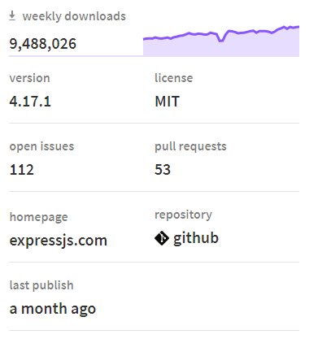
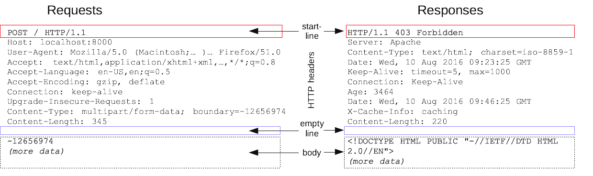
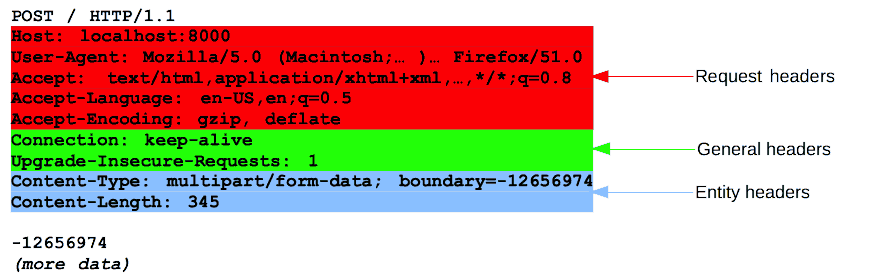
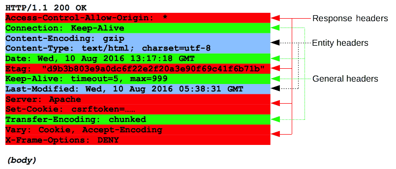

# Week 2

-  [Week 2](#week-2)
-  [Homework 1](#homework-1)
-  [Video](#video)
-  [Installing new modules using npm](#installing-new-modules-using-npm)
   -  [Intialising a new module using npm init](#intialising-a-new-module-using-npm-init)
   -  [Installing new packages using npm install](#installing-new-packages-using-npm-install)
      -  [Installing moment](#installing-moment)
   -  [Using moment](#using-moment)
   -  [A note about semantic versioning](#a-note-about-semantic-versioning)
-  [REST API](#rest-api)
   -  [HTTP messages](#http-messages)
      -  [HTTP Requests](#http-requests)
      -  [HTTP Responses](#http-responses)
   -  [Routing](#routing)
   -  [HTTP methods](#http-methods)
   -  [HTTP status codes](#http-status-codes)
      -  [What is REST?](#what-is-rest)
-  [Express](#express)
-  [Homework](#homework)

# Homework 1

The correction for homework 1 is here: [https://github.com/dfdeagle47/Node.js/tree/master/week1/homework](https://github.com/dfdeagle47/Node.js/tree/master/week1/homework).

# Video

The video of the lecture can be found here: [https://drive.google.com/open?id=1owB09tnNbyUnObhD72-jpwwtqBxcoify](https://drive.google.com/open?id=1owB09tnNbyUnObhD72-jpwwtqBxcoify).

# Installing new modules using `npm`

References:

- [https://docs.npmjs.com/](https://docs.npmjs.com/)
- [http://npmjs.com/](https://www.npmjs.com/)

When you install node, it automatically installs another tool called `npm` which stands for *Node Package Manager*. This is a command-line utility which lets you easily install new modules from the npm registry.

## Intialising a new module using `npm init`

Whenever you start a new project, you should run the `npm init` command in that folder. It will start an interactive prompt to ask you a few questions

- *package name*: this is the name of your application.
- *version*: this is the version number.
- *description*: this is the description of your application.
- *entry point*: this is the "main" js file of your application. This is the file which will be executed if you run the command `node .` in that folder.
- *test command*: this the command that should be run for tests. You can leave it blank when starting.
- *git repository*: this is the URL to the git repository of your application.
- *keywords*: those are tags that characterize your application. Keywords should be separated by spaces.
- *license*: this is the licence that is associated with your package. You can leave it as is.

When you're finished, it should write a `package.json` file in your folder. This file contains all the information you've typed in.

## Installing new packages using `npm install`

Once your folder is initialised, you can install new packages using the command `npm install <package-name>`. This will install the package from the npm registry: [https://www.npmjs.com/](https://www.npmjs.com/). You can search for package on the registry.

Node.js has a big ecosystems of third-party modules you can pick from. You can use those modules, so you don't have to re-invent the wheel. Most node package tend to follow the [Unix philosophy](https://en.wikipedia.org/wiki/Unix_philosophy): they tend to be small and do one thing, but do it well. This encourages modular design in your code where it depends on many packages. Of course, at times, this can be problematic for security reasons or stability issues if there are many packages.

The quality of packages can also vary, so it's good to look at certain things when searching for package. Let's look at the express module: [https://www.npmjs.com/package/express](https://www.npmjs.com/package/express). For each package, you will have certain stats

- The weekly downloads gives you a rough idea of its popularity. The more popular a package is, the higher the chance it's a good one.
- You can also look at the last publish date. If it was last published 3 years ago, it might mean this package is not maintained anymore, so it might not even work with your current version of node.
- Bigger projects usually have a homepage with extensive documentation. This is usually a good sign because it means it's a mature project.

You can find more information at the top

- Dependencies: you can see if this package depends on other packages.
- Dependents: you can see if many packages depend on this package. If it's high, it means it's a popular package that's central in the node eco-system, so it should be safe to use (it will likely not disappear overnight).
- If there are many versions, it's also a good sign that it's actively maintained.

On the Github page

- You can see the number of stars to see if it's popular.
- The number of commits gives an idea of the maturity of the project (if it only has a few commits, it might be at a very early stage).
- You can also see if there are many issues. However, even if it's high, it doesn't mean it's bad. It's normal that more popular libraries have more bug reports. If you have issues with the package, you should look into the Github issues to see if it's not something that has already been reported. They might have a workaround.

### Installing `moment`

Let's install a package. We'll use `moment` because it's a simple package: [https://www.npmjs.com/package/moment](https://www.npmjs.com/package/moment). This library makes it easy to interact with dates. To install, we should run the command `npm install moment` and it will fetch the package from npmjs.com and install it:

`bash`

    $ npm install moment
    npm info it worked if it ends with ok
    npm info using npm@6.4.1
    npm info using node@v10.15.3
    npm timing npm Completed in 111ms
    npm info ok
    npm info it worked if it ends with ok
    npm info using npm@6.4.1
    npm info using node@v10.15.3
    npm http fetch GET 304 https://registry.npmjs.org/moment 149ms (from cache)
    npm timing stage:loadCurrentTree Completed in 734ms
    npm timing stage:loadIdealTree:cloneCurrentTree Completed in 0ms
    npm timing stage:loadIdealTree:loadShrinkwrap Completed in 20ms
    npm timing stage:loadIdealTree:loadAllDepsIntoIdealTree Completed in 17ms
    npm timing stage:loadIdealTree Completed in 43ms
    npm timing stage:generateActionsToTake Completed in 6ms
    npm timing audit compress Completed in 5ms
    npm info audit Submitting payload of 281bytes
    npm timing action:extract Completed in 360ms
    npm timing action:finalize Completed in 8ms
    npm timing audit submit Completed in 519ms
    npm http fetch POST 200 https://registry.npmjs.org/-/npm/v1/security/audits/quick 518ms
    npm timing audit body Completed in 0ms
    npm timing action:refresh-package-json Completed in 44ms
    npm info lifecycle moment@2.24.0~preinstall: moment@2.24.0
    npm timing action:preinstall Completed in 3ms
    npm info linkStuff moment@2.24.0
    npm timing action:build Completed in 3ms
    npm info lifecycle moment@2.24.0~install: moment@2.24.0
    npm timing action:install Completed in 4ms
    npm info lifecycle moment@2.24.0~postinstall: moment@2.24.0
    npm timing action:postinstall Completed in 2ms
    npm timing stage:executeActions Completed in 562ms
    npm timing stage:rollbackFailedOptional Completed in 0ms
    npm timing stage:runTopLevelLifecycles Completed in 1351ms
    npm info lifecycle undefined~preshrinkwrap: undefined
    npm info lifecycle undefined~shrinkwrap: undefined
    npm notice created a lockfile as package-lock.json. You should commit this file.
    npm info lifecycle undefined~postshrinkwrap: undefined
    npm WARN npm@1.0.0 No description
    npm WARN npm@1.0.0 No repository field.
    
    + moment@2.24.0
    added 1 package from 6 contributors and audited 1 package in 1.38s
    found 0 vulnerabilities
    
    npm timing npm Completed in 2403ms
    npm info ok

If you look at the `package.json` file, you can see there's a new field called `dependencies` :

    {
      ...
      "dependencies": {
        "moment": "^2.24.0"
      }
      ...
    }

Whenever you install a package, it will add a new entry to the `package.json` file.

Also, it creates a new folder called `node_modules` with a subfolder `moment`. All the installed packages will be stored in the `node_modules` folder. Note that those packages are installed locally in your application folder, so they will not be accessible to other folders.

The `node_modules` folder should be added to your `.gitignore` file (this is a file which tells git to ignore certain files/folders in your application, see [here](https://git-scm.com/docs/gitignore)). This because we don't need the actual installed packages: all the useful information is stored in your `package.json`. If you delete the `node_modules` folder, you can re-install all the dependencies from your `package.json`  by running the command `npm install`  in your folder (without a package name).

## Using `moment`

The syntax to use a installed module in your code is the same as the syntax for native modules. In this case, we will use `require('moment')`. When using a module, you should always look at the documentation to see how it can be used (there are no standard). Fortunately, moment has an [extensive documentation](https://momentjs.com/docs/). Here's an example of how to use an installed module

`index.js`

    // We use the `require` statement to use the `moment` package.
    const moment = require('moment');
    
    console.log('This is the main file.');
    
    // This is a command in moment to change the locale (i.e. the language used) to French ('fr')
    moment.locale('fr');
    
    // This will print the date according the format defined in https://momentjs.com/docs/#/displaying/
    // In this case, it will be something like: "Dimanche 23/06/2019 13:23". where "Dimanche" is the French translation for "Sunday" since we changed the locale
    console.log('Date:', moment().format('dddd DD/MM/YYYY HH:mm'));

To summarise, when you want to use an external module, you should follow this process

1. Do a search on [https://www.npmjs.com/](https://www.npmjs.com/) and find the module which fits your needs. Look at how popular the modules are, if they're maintained, etc.
2. Install the module using `npm install <package-name>`. This will add it to the `node_modules` folder and it will be added in the `dependencies` property of your `package.json` file.
3. Look at the module documentation, and use the `require` statement to call it in your code.

## A note about semantic versioning

In nodejs, versions for packages are represented by 3 sets of numbers numbers (e.g. 2.12.34). They follow a standard called [*semantic versioning*](https://semver.org/). The reasoning is as follows

> Given a version number MAJOR.MINOR.PATCH, increment the:
  1. MAJOR version when you make incompatible API changes,
  2. MINOR version when you add functionality in a backwards-compatible manner, and
  3. PATCH version when you make backwards-compatible bug fixes.

Additional labels for pre-release and build metadata are available as extensions to the MAJOR.MINOR.PATCH format.

This means that it is usually safe to increment the middle and last sets of digits (minor and patch) because they only add new features, and fix bugs. If you change the first (major) digits, it means there are some breaking changes, so you might need to change your code if you want to update the major version.

In the `package.json`, the dependencies will have a `^` by default like `"moment": "^2.24.0"`. This tells `npm` that it is OK to install a newer version of the package if the minor or patch version change, but not if the major version changes. There's also the `~` prefix like `"moment": "~2.24.0"`, if you only want to update automatically the patch version, but not the minor or major versions.

There are also other prefixes and ranges you can define in the `package.json` and you can find more information [here](https://docs.npmjs.com/misc/semver).

# REST API

In this section, we will take about creating a web server to respond to requests from clients, and we will implement it as a REST API. We'll begin by looking at how the *client/frontend* (i.e your browser such as Google Chrome or Mozilla Firefox) interacts with the server/backend (the website you're trying to reach such as www.facebook.com).

## HTTP messages

Reference: [https://developer.mozilla.org/en-US/docs/Web/HTTP/Messages](https://developer.mozilla.org/en-US/docs/Web/HTTP/Messages)

To interact, the client and the server use the HTTP protocol which is a standard which defines how the communication should take place.

1. The communication is initiated by the client by creating an *HTTP request*
2. The server receives the request and processes it
3. Once processed, it will send back an *HTTP response* to the client.

The structure of the requests and responses are similar and can be represented as a string following with different sections.

### HTTP Requests

**Request line**

1. An **HTTP method**, a verb (like GET, PUT or POST) or a noun (like HEAD or OPTIONS), that describes the action to be performed.
2. The **request target**, usually a URL, or the absolute path of the protocol, port, and domain are usually characterized by the request context.
3. (HTTP version)

**Headers**

HTTP headers from a request follow the same basic structure of an HTTP header: a case-insensitive string followed by a colon (':') and a value whose structure depends upon the header. The whole header, including the value, consist of one single line, which can be quite long.

1. *General headers*, like Via, apply to the message as a whole.
2. *Request headers*, like User-Agent, Accept-Type, modify the request by specifying it further (like Accept-Language), by giving context (like Referer), or by conditionally restricting it (like If-None).
3. *Entity headers*, like Content-Length which apply to the body of the request. Obviously, there is no such header transmitted if there is no body in the request.

**Body**

The final part of the request is its body. Not all requests have one: requests fetching resources, like GET, HEAD, DELETE, or OPTIONS, usually don't need one. Some requests send data to the server in order to update it: as often the case with POST requests (containing HTML form data).

### HTTP Responses

**Status line**

1. The *protocol version*, usually `HTTP/1.1`.
2. A *status code*, indicating success or failure of the request. Common status codes are `[200](https://developer.mozilla.org/en-US/docs/Web/HTTP/Status/200)`, `[404](https://developer.mozilla.org/en-US/docs/Web/HTTP/Status/404)`, or `[302](https://developer.mozilla.org/en-US/docs/Web/HTTP/Status/302)`
3. A *status text*. A brief, purely informational, textual description of the status code to help a human understand the HTTP message.

**Headers**

**Body**

The last part of a response is the body. Not all responses have one: responses with a status code, like 201 or 204, usually don't.

## Routing

Routing refers for determining the way in which an application responds to a client request to a particular endpoint. What we mean by endpoint is the path that characterizes the URL. For example, on Facebook, you have different endpoints such as

- [https://www.facebook.com/](https://www.facebook.com/)
- [https://www.facebook.com/events/](https://www.facebook.com/events/)
- [https://www.facebook.com/events/calendar/](https://www.facebook.com/events/calendar/)
- [https://www.facebook.com/groups/](https://www.facebook.com/groups/)
- ...

## HTTP methods

When we deal with data, there are 4 types of operations we usually want to do, summarized by the acronym CRUD

- Create: we want to add new data and store it.
- Read: we want to retrieve this data from the storage.
- Update: we want to update stored data.
- Delete: we want to delete the stored data.

The HTTP methods which characterize the requests are usually used to tell the server which type of operation we are trying to do.

- GET = READ: fetches an existing resource (and should have no other effect).
- POST = CREATE: creates a new resource.
- PUT (or PATCH) = UPDATE: modify an existing resource.
- DELETE: deletes a resource.

## HTTP status codes

Reference: [https://en.wikipedia.org/wiki/List_of_HTTP_status_codes](https://en.wikipedia.org/wiki/List_of_HTTP_status_codes)

When the server responds to a request, it will include a status code. The status code gives you some information about the response (if it failed and if so why for instance). Here are some common error codes returned by a server.

- 1xx (Informational): The request was received, continuing process
- 2xx (Successful): The request was successfully received, understood and accepted
    - 200 OK
- 3xx (Redirection): Further action needs to be taken in order to complete the request
    - 301 Moved Permanently
    - 302 Found (Previously "Moved temporarily")
- 4xx (Client Error): The request contains bad syntax or cannot be fulfilled
    - 400 Bad Request
    - 401 Unauthorized
    - 403 Forbidden
    - 404 Not Found
- 5xx (Server Error): The server failed to fulfill an apparently valid request
    - 500 Internal Server Error

### What is REST?

Reference: [https://en.wikipedia.org/wiki/REST_API](https://en.wikipedia.org/wiki/REST_API)

REST stands for Representational state transfer which essentially refers to a style of web architecture that has many underlying characteristics and governs the behavior of clients and servers.

When you architecture a RESTful web server (i.e. which respects the REST API convention), it will be implemented as follows

- The path (the part after the .com, e.g. "/events" is the path of [https://www.facebook.com/events](https://www.facebook.com/events/)) will determine the resource you're trying to access.
- The HTTP method will determine the operation you're trying to do (e.g. a "GET" means you're trying to access, or "read", a resource).

Let's take an example of a REST API: [https://jsonplaceholder.typicode.com/](https://jsonplaceholder.typicode.com/).

They define the following routes amongst others:

- GET	`/posts`
    - GET = read operation
    - `/posts` path = it relates to posts
    - It doesn't specify an id after the `/posts`
    - This endpoint is about retrieving all the posts on the server.
- GET `/posts/1`
    - GET = read operation
    - `/posts` path = it relates to posts
    - `/1` = we want to get the post with an id of "1"
    - This endpoint is about retrieving a specific post with an id of "1" on the server.
- GET `/posts/1/comments`
    - GET = read operation
    - `/posts` path = it relates to posts
    - `/1` = we want to get the post with an id of "1"
    - `/comments` = we want to get the comments as a sub resource of posts.
    - This endpoint is about retrieving the comments from a single post with an id of "1" on the server.
- GET `/comments?postId=1`
    - GET = read operation
    - `/comments` path = it relates to comments
    - `?postId=1` search string = we are trying to filter the comments which have a `postId` of 1
    - This endpoint is about retrieving all the comments which have a `postId` of "1" from the server.
- GET `/posts?userId=1`
    - GET = read operation
    - `/posts` path = it relates to posts
    - `?userId=1` search string = we are trying to filter the post which have a `userId` of 1
    - This endpoint is about retrieving all the comments which have a `userId` of "1" from the server.
- POST `/posts`
    - POST = create operation
    - `/posts` path = it relates to posts
    - This endpoint is about creating a new post on the server. The content of that new post will be present in the body of the request.
- PUT `/posts/1`
    - PUT = update operation
    - `/posts` path = it relates to posts
    - `/1` = it relates to the post with an id of "1"
    - This endpoint is about updating the post with an id of "1" on the server. The content of that updated post will be present in the body of the request.
- DELETE `/posts/1`
    - DELETE = delete operation
    - `/posts` path = it relates to posts
    - `/1` = it relates to the post with an id of "1"
    - This endpoint is about deleting a post with an id of "1" on the server.

# Express

Reference: [https://expressjs.com/](https://expressjs.com/)

Express is a minimalist web framework for node.js. It makes it easy to start a web server (for a REST API for instance). To install it, you can use the `npm install express` command. Here is a basic example of how to use it

`index.js` ([source](https://expressjs.com/en/starter/hello-world.html))

    // We use the `require` statement to include the express module.
    const express = require('express');
    
    // We create a web server app.
    const app = express();
    
    // This parameter is the "port" where our web server will run.
    const port = 3000;
    
    // This defines a "GET" route with a path of "/" that we will have access to.
    app.get('/', (req, res) => res.send('Hello World!'));
    
    // This starts the web server. The base URL for our web server is http://localhost:3000/
    // The `localhost` is a special name which refers to your own computer (since the server
    // is running on your own computer).
    // The ":3000" is how we define the "port" that should be used (3000 in our case).
    app.listen(port, () => console.log(`Example app listening on port ${port}!`));

# Homework

We will try to make a simplified REST api (using only GET request with express).

`index.js` ([source](https://github.com/dfdeagle47/Node.js/blob/master/week2/homework/index.js))

    // We want to build a web server which stores posts. Posts are objects with the following structure: { id: '3', title: 'Title of the post', text: 'Content of the post.' }.
    // Those posts will be stored in a 'posts' array on the server.
    //
    // We want to be able to handle several operations based on the following routes
    // - "GET /posts" returns all the posts stored in the server as an array.
    // - "GET /posts/:postId" returns a specific post (as an object) identified by the id given by the parameter `postId`
    // - "GET /posts/:postId/delete" deletes a specific post identified by the id given by the parameter `postId`.
    //   Once deleted, this post should not appear in the list returned by the "GET /posts" route.
    //
    // This folder has already been initialized with a package.json. The package.json also lists the module `express` as a dependency.
    // Before starting the homework, you should run the command `npm install` once in this folder to install express (it should create a node_modules folder).
    // Once installed, you can run the application using `node index.js`. When you run the server, you can access the base route by going to your browser on http://localhost:3000/.
    //  - If you want to execute the "GET /posts" route, you should navigate to "http://localhost:3000/posts"
    //  - If you want to execute the "GET /posts/:postId" route, you should navigate to something like "http://localhost:3000/posts/3" if the post has an id of "3"
    //  - If you want to execute the "GET /posts/:postId/delete" route, you should navigate to "http://localhost:3000/posts/3/delete" if the post has an id of "3"
    //
    // Note: whenever you make a change to this file, you should restart your web server. You can hit CTRL+C in your terminal to kill the web server.
    //
    // Bonus: if you want to go further, you can store the posts in a file instead of using a JavaScript array using the fs module.
    // You can use the JSON.parse() and JSON.stringify() functions to parse a string to a JavaScript object and vice-versa.
    
    // The express module is used to make the web server
    const express = require('express');
    
    // Configuration of the web server
    const app = express();
    const port = 3000;
    
    // The variable `posts` is an array which stores all the posts.
    // Right now, it only adds
    const posts = [
      { id: '3', title: 'Title of the post', text: 'Content of the post.' },
    ];
    
    // If you navigate to http://localhost:3000/, it will respond with the string 'Hello World!'
    app.get('/', (req, res) => {
      console.log('Responding with `Hello World!`');
    
      res.send('Hello World!');
    });
    
    // If you navigate to http://localhost:3000/hello-2, it will respond with the string 'Hello World 2!'
    app.get('/hello-2', (req, res) => {
      console.log('Responding with `Hello World 2!`');
    
      res.send('Hello World 2!');
    });
    
    // If you navigate to http://localhost:3000/hello/:name, it will respond with the string 'Hello <the value of the name parameter>!'.
    // For example, try it with
    // - http://localhost:3000/hello/john
    // - http://localhost:3000/hello/mary
    // - http://localhost:3000/hello/tom
    app.get('/hello/:name', (req, res) => {
      // The parameter ":name" in the route is stored in the `req.params` object in express.
      // Parameters can be identified because they have a prefix of ":" in front of the parameter.
      const name = req.params.name;
    
      console.log(`Responding with "Hello ${name}!"`);
    
      res.send(`Hello ${name}!`);
    });
    
    // This is the GET /posts route
    app.get('/posts', (req, res) => {
      console.log('sending posts...');
    
      // Right now, we just returning the "sending posts..." string. We should this so that we return the `posts` array that we defined above.
      res.send('sending posts...');
    });
    
    //
    // You can add the other two routes here
    // 1. "GET /posts/:postId"
    // 2. "GET /posts/:postId/delete"
    //
    
    // This starts the web server
    app.listen(port, () =>
      console.log(
        `Example app listening on port ${port}!\nYou can access the base route by going to http://localhost:${port}/ in your browser.`
      )
    );